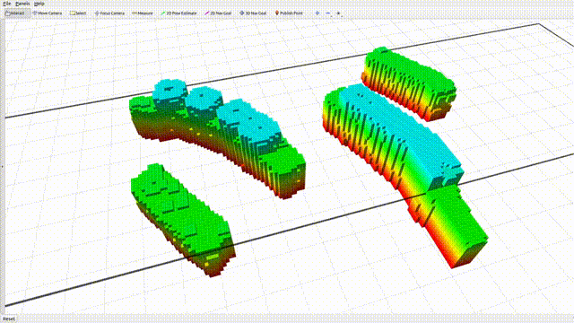

# MARTS-Planner
ROS 1 Version Code for paper "Safe and Agile Transportation of Cable-Suspended Payload via Multiple Aerial Robots".

You can find the **ROS 2 version** of the code here: https://github.com/WwwangJJ/MARTS-Planner-ROS2

The **pure C++ version** and a **Python `ctypes` example** (calling the shared library) are available here: https://github.com/WwwangJJ/MARTS-Planner-Lib

## Applications

### Example 1: Replan Mode
This mode is used for re-planning, just as described in the paper, the planning time required for each re-planning is real-time level, under the premise of reasonable parameter selection. For installation, the following terminal commands are helpful.

### 1. Requirements
The code is tested on clean Ubuntu 20.04 with ROS noetic installation.
Install the required packages.

    sudo apt update
    sudo apt install cpufrequtils
    sudo apt install libompl-dev

### 2. Download and compile the code
Download the code.

    mkdir transport-multiple; cd transport-multiple; mkdir src; cd src
    git clone https://github.com/ZJU-FAST-Lab/MARTS-Planner.git
    cd ..

Compile the code.

    catkin_make -DCATKIN_WHITELIST_PACKAGES="quadrotor_msgs"
    catkin_make -DCATKIN_WHITELIST_PACKAGES=""

### 3. Run the replan mode

    roslaunch gcopter Astar_planning_RM.launch

After conduct the command, you will see the window for rviz. Please follow the gif below for trajectory planning in a random map.
    

    

Use 3D Nav Goal to select the starting point (first time) and the end point. 
#### Note: The target point must not be inside the obstacle. The black outer border on the map is the map range, and the target point cannot exceed the map range.

### Example 2: Real world S-shaped obstacle avoidance trajectory
This example shows the planner for a real world S-shaped obstacle avoidance trajectory which is showed in the gif below.

    

Conduct the command
    roslaunch gcopter Astar_planning_S.launch

Then you will see the window for rviz. Use the 2D Nav Goal tool to plan the trajectory in the map modeled from the real world.

    

